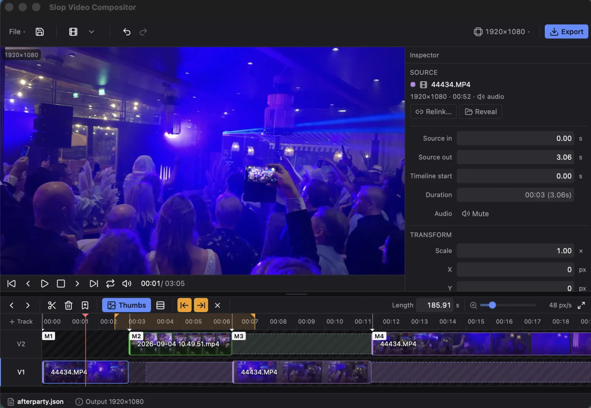

# Slop Video Compositor

[](LICENSE)
[](https://github.com/meigo/slop-video-compositor)

Desktop multi-shot **hard-cut** video compositor: load local video and audio onto tracks, trim/cut/reorder, reframe on a fixed canvas, export one **H.264 + AAC MP4**.



**Stack:** Tauri 2 + SvelteKit + TypeScript, with **ffmpeg** on your `PATH` (not bundled).

| | |
|--|--|
| **License** | MIT |
| **Platform** | macOS-first (Tauri desktop) |
| **Export** | H.264 + AAC MP4 @ **30 fps**, project canvas size |
| **Edit grid** | Timeline / frame step at fixed **30 fps** (no per-clip fps UI) |
| **Resolve** | Same-track overwrite; higher track wins for picture; audio beds underlay |

## Features

### Timeline
- Multi-track: import, move, trim in/out, split at playhead, delete (**no ripple**)
- Same-track **overwrite** (dragged clip wins); **higher track** wins across tracks for picture
- **Audio-only** import (mp3/m4a/…) as beds — underlay under video, never occlude picture
- **Per-clip mute** (preview + export)
- **Gap hatch** on empty track time; **trim handles** show unused source outside in/out
- Per-source clip colors; long names truncated (full path on hover)
- Snap on drag/trim (**Shift** = free); Fit zoom; **S/M/L** track row height
- Optional **filmstrips** on video clips and **waveforms** on audio (Thumbs toggle; prefs persist)
- **Program out** sequence end (shortening trims/deletes media past that time)
- Import placement: append / at playhead / each file → new track
- Named **markers** (seek, double-click rename, Alt+click remove); **⌥-drag** copy clips
- Multi-select (⌘/Ctrl-click) + group time move; copy / paste / duplicate

### Preview & export
- Dual-buffer free-run with hard-cut prefetch; track **solo** (preview only)
- **Play range** I/O (session, preview only — export still uses full program out)
- **Loop** playback within the play range or full sequence
- Viewport pan/zoom vs clip transform (Ctrl/⌘ pan, Shift scale)
- Export filename from project name / duration / clip count; reveal in Finder
- Relink + Reveal source; autosave `*.autosave.json`; startup **ffmpeg** check

### UI chrome
- Compact toolbar: **File ▾**, **Import** + place menu, **Export**, undo/redo, **Canvas ▾**
- Timeline tool strip: Prev/Next cut, Split, Delete, Thumbs, S/M/L, I/O range, Marker

## Requirements

| Tool | Notes |
|------|--------|
| **Node.js** | LTS (`npm`) |
| **Rust** | Stable (`rustc` / `cargo`) for Tauri |
| **ffmpeg** | Probe, filmstrips, waveforms, encode — must be on `PATH` |

```bash
# macOS (Homebrew)
brew install ffmpeg
```

Also: [Rust toolchain](https://rustup.rs/) and [Tauri 2 prerequisites](https://v2.tauri.app/start/prerequisites/) if packaging.

## Download

macOS builds (Apple Silicon + Intel) are on the
[Releases](https://github.com/meigo/slop-video-compositor/releases) page. Pushing a `v*` tag builds
both DMGs into a draft release, which a maintainer then publishes.
Install ffmpeg separately (`brew install ffmpeg`). First launch: right-click → Open if Gatekeeper blocks the unsigned app.

## Development

```bash
npm install
npm run tauri dev
```

| Command | Purpose |
|---------|---------|
| `npm run dev` | Frontend only (no Tauri shell) |
| `npm run build` | Production frontend build |
| `npm run check` | TypeScript / svelte-check |
| `npm test` | Vitest (timeline/export pure logic) |
| `npm run tauri build` | Package the desktop app |
| `cd src-tauri && cargo test` | Rust unit tests |

## Usage

1. **Import** (`Import` or ⌘I) — video and/or audio. Default **appends** on the selected track. Import ▾ for playhead or each-file→new-track (⌘⇧I).
2. **Edit** on the timeline: drag to move (snaps), edge-drag to trim (dim **handles** = unused media still on disk), **S** split, Delete remove. **⌥-drag** duplicates.
3. **Thumbs** — filmstrips on video, waveforms on audio beds; **S/M/L** track height. First generation may take a few seconds (cached after that).
4. **Reframe** in the preview: **Ctrl/⌘-drag** pans the clip; **Shift-drag** scales; wheel zooms the **viewport**. Timeline **Fit** fills the track width.
5. **Play range** (optional): **I** / **O** at the playhead for preview-only in/out; **L** loop; export ignores the range.
6. **Canvas ▾** — presets (1080p, 720p, vertical, square) or custom even W×H.
7. **Save** project JSON (absolute source paths). Dirty projects autosave as `name.autosave.json`.
8. **Export** → MP4 (last export dir or `~/Movies/Slop Refs`) → Finder reveals on success.
9. Use the MP4 wherever you need a single hard-cut reference (any editor, player, or pipeline).

Missing media: **Relink…** or **Reveal** in the Inspector. Open warns if sources fail to probe.

### Related tools

Optional companions in the same family (not required to use this app):

- **[slop-video-downloader](https://github.com/meigo/slop-video-downloader)** — gather source clips  
- **[slop-animator](https://github.com/meigo/slop-animator)** — open the exported MP4 as a video reference  

Typical flow when using all three: download → compose here → animate from the export.

## Keyboard shortcuts

| Key | Action |
|-----|--------|
| Space | Play / pause |
| ← / → | Step **1 frame** (30 fps) |
| Shift+← / → | Step **1 second** |
| Home / End | Sequence start / end |
| `[` / `]` | Previous / next cut (clip edges + markers) |
| I / O | Set play-in / play-out at playhead (preview only) |
| Esc | Clear play range (when not editing a field) |
| L | Toggle loop playback |
| M | Marker at playhead |
| S | Split selected clip at playhead |
| Delete / Backspace | Delete selected clip(s) |
| ⌘C / ⌘V / ⌘D | Copy / paste / duplicate |
| ⌘-click clip | Add/remove from multi-select |
| ⌥-drag clip | Duplicate while dragging |
| ⌘S / ⌘⇧S | Save / Save As |
| ⌘O | Open project |
| ⌘I / ⌘⇧I | Import / import each → new track |
| ⌘Z / ⌘⇧Z | Undo / Redo |
| Shift (while dragging) | Disable snap |

Ignored while focus is in text fields.

### Timeline notes

- **Snap** targets: clip edges, markers, playhead, sequence ends.
- **Program out:** blue sequence-end handle — drag right for black tail; left trims/deletes past that time (on release).
- **Trim handles:** dashed extensions = media still in the file but outside the used range.
- **Gap hatch:** empty track time (no clip, not trimmed media).
- **Solo:** double-click a track label (preview only; export uses all tracks).
- **Markers:** click seek; double-click rename; Alt+click remove.
- **Thumbs / S·M·L:** session prefs persist in app settings (with timeline height).
- **Audio beds:** audio-only clips never win the picture track; they mix under the hard-cut video.

## Project files

JSON `version: 1` — name, canvas, duration (program out), tracks, clips (`sourcePath`, `sourceIn` / `sourceOut`, `timelineStart`, transform, optional `muted`), optional **markers** (`t`, `label`). Paths are absolute; use Relink if a file moves.

Filmstrips and waveforms are **not** stored in the project (generated via ffmpeg, disk-cached under the OS cache dir).

## Design

Internal design notes live under `docs/superpowers/specs/` (e.g. main design, filmstrips, loop, export filename). Preview hard-cuts use dual HTML video buffers — good free-run feedback, not a pro NLE frame cache.

## Contributors

<table>
  <tr>
    <td align="center" width="140">
      <a href="https://github.com/meigo">
        <br />
        <sub><b>Meigo Kukk</b></sub>
      </a><br />
      <sub>owner</sub>
    </td>
    <td align="center" width="140">
      <a href="https://x.ai/">
        <br />
        <sub><b>Grok</b></sub>
      </a><br />
      <sub>xAI · co-author</sub>
    </td>
  </tr>
</table>

Assisted by **[Grok](https://x.ai/)** (xAI). Commits may include:

```text
Co-Authored-By: Grok <noreply@x.ai>
```

## License

MIT — see [LICENSE](LICENSE).
